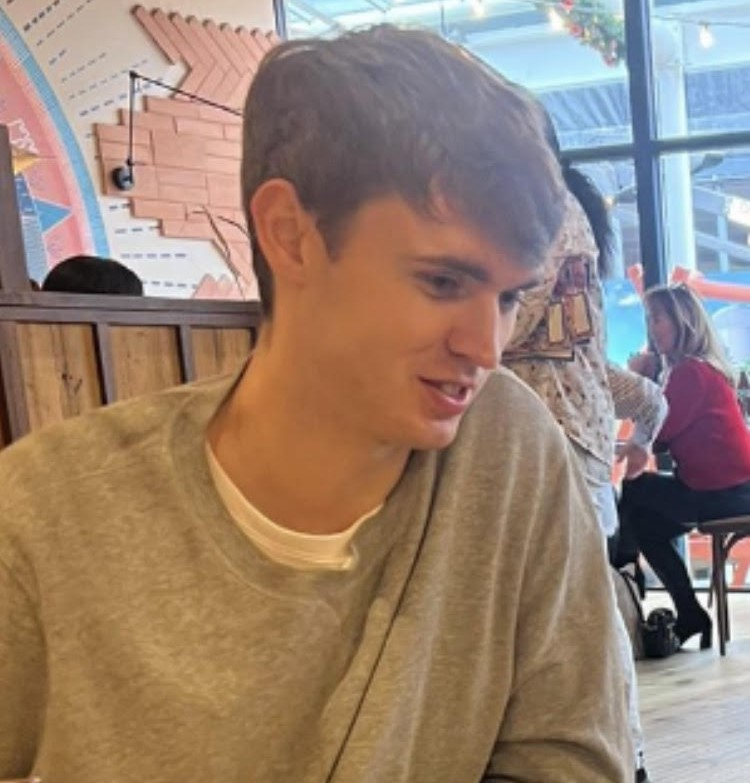

# Daniel Donnelly
**AI Researcher**  

---

## About
I’m an AI researcher with experience in machine learning, reinforcement learning, uncertainty quantification, and runtime verification. My current research focuses on developing language-based approaches for reward specification and monitoring for reinforcement learning agents, leveraging frameworks like Runtime Monitoring Language (RML).

---

## Education
- **MRes in Artificial Intelligence and Machine Learning**, 2024  
  Imperial College London

- **MSc in Data Science and AI**, 2023  
  Queen Mary University of London

- **BSc in Mathematics**, 2022  
  Cardiff University

---

## Contact
[Email](mailto:danieldonnelly46@gmail.com) | [GitHub](https://github.com/danieldonnelly7) | [LinkedIn](www.linkedin.com/in/daniel-donnelly-428701170)
